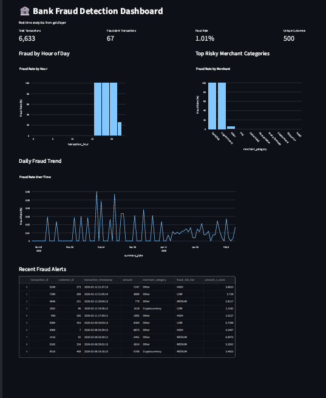

```markdown
# 🏦 Bank Fraud Detection System


A complete data engineering project simulating a bank’s data infrastructure for fraud detection. The pipeline ingests CRM and ERP data, transforms it through bronze/silver/gold layers, and exposes analytics via an interactive dashboard.

## 🎯 Features

- **Realistic Data Generation**: 500 customers, 750 accounts, 10,000 transactions with 1% fraud.
- **Medallion Architecture**: Bronze (raw), Silver (cleaned), Gold (analytics‑ready) layers.
- **Fraud Detection Features**: 40+ engineered features (amount Z‑score, time since last transaction, rolling counts, etc.).
- **Interactive Dashboard**: Streamlit dashboard with KPI cards, hourly fraud analysis, merchant risk, daily trends, and recent alerts.
- **Containerized Database**: PostgreSQL running in Docker for easy setup.

## 🛠️ Tech Stack

- **Python** (Pandas, SQLAlchemy, Streamlit, Plotly)
- **PostgreSQL** (Database)
- **Docker** (Containerization)
- **Git** (Version control)

## 📁 Project Structure

```
├── data/               # Raw CSV files (generated, not committed)
├── src/                # ETL scripts
│   ├── load_bronze.py
│   ├── transform_to_silver.py
│   ├── transform_to_gold.py
│   └── ...
├── sql/                # Database schema
├── dashboard/          # Streamlit dashboard app
├── requirements.txt    # Python dependencies
└── README.md
```

## 🚀 Quick Start

### Prerequisites
- **Docker** installed and running ([Get Docker](https://docs.docker.com/get-docker/))
- **Python 3.9+** installed ([Get Python](https://www.python.org/downloads/))

### Setup

1. **Clone the repository**
   ```bash
   git clone https://github.com/YOUR_USERNAME/bank-fraud-detection.git
   cd bank-fraud-detection
   ```

2. **Install Python packages**
   ```bash
   pip install -r requirements.txt
   ```

3. **Start PostgreSQL with Docker**
   ```bash
   docker run --name bank-db -e POSTGRES_PASSWORD=password -p 5432:5432 -d postgres
   ```

4. **Generate sample data**
   ```bash
   python data/create_sample_data.py
   ```

5. **Load data into bronze layer**
   ```bash
   python src/load_bronze.py
   ```

6. **Transform to silver layer**
   ```bash
   python src/transform_to_silver.py
   ```

7. **Transform to gold layer**
   ```bash
   python src/transform_to_gold.py
   ```

8. **Launch the dashboard**
   ```bash
   streamlit run dashboard/app.py
   ```
   Open [http://localhost:8501](http://localhost:8501) in your browser.

## 📊 Dashboard Preview

 

## 📈 Key Insights

- **Fraud rate**: ~1% of transactions are fraudulent.
- **High‑risk hours**: Most fraud occurs between 2–5 AM.
- **Risky merchant categories**: Gambling, cryptocurrency, and foreign merchants have the highest fraud rates.
- **Customer risk tiers**: Segments like "Wealth" and "Business" show higher fraud exposure.

## 🧠 What I Learned

- Designing a medallion architecture for data pipelines.
- Feature engineering for fraud detection (velocity, amount Z‑score, etc.).
- Building an end‑to‑end ETL pipeline with Python and PostgreSQL.
- Creating interactive dashboards with Streamlit.
- Containerizing services with Docker.

## 🔮 Future Improvements

- Add real‑time streaming with Kafka.
- Deploy a machine learning model (e.g., Random Forest) on gold features.
- Implement CI/CD with GitHub Actions.
- Use environment variables for database credentials.

## 📬 Contact

Feel free to reach out via [LinkedIn](https://www.linkedin.com/in/abdulmalik-sanusi-b3a0813a3) 

---

**Built with ❤️ for my data engineering portfolio.**
